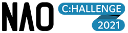
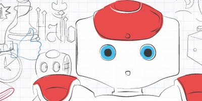

# Nao-Challenge-2021

[![Contributors][contributors-shield]][contributors-url]
[![Forks][forks-shield]][forks-url]
[![Stargazers][stars-shield]][stars-url]
[![Issues][issues-shield]][issues-url]
[![MIT License][license-shield]][license-url]
[![LinkedIn][linkedin-shield]][linkedin-url]

<br/>
<p align="center">
  <a href="https://www.naochallenge.it/en/home-english">
    
  </a>
  <a href="http://www.veronatrento.it">
    
  </a>

  <h3 align="center">PROGETTO NAO CHALLENGE 2021</h3>

  <p align="center">
    <br/>
    <a href="https://github.com/AY02/Nao-Challenge-2021"><strong>Export documentation »</strong></a>
    <br/>
    <br/>
    <a href="https://github.com/AY02/Nao-Challenge-2021">View Demo</a>
    ·
    <a href="https://github.com/AY02/Nao-Challenge-2021/issues">Report Bug</a>
    ·
    <a href="https://github.com/AY02/Nao-Challenge-2021/issues">Report Issues</a>
  </p>
</p>

<details open="open">
  <summary>Index Table</summary>
  <ol>
    <li>
      <a href="#about-the-project">About The Project</a>
      <ul>
        <li><a href="#built-with">Built With</a></li>
      </ul>
    </li>
    <li>
      <a href="#getting-started">Getting Started</a>
      <ul>
        <li><a href="#prerequisites">Prerequisites</a></li>
        <li><a href="#installation">Installation</a></li>
      </ul>
    </li>
    <li><a href="#usage">Usage</a></li>
    <li><a href="#roadmap">Roadmap</a></li>
    <li><a href="#contributing">Contributing</a></li>
    <li><a href="#license">License</a></li>
    <li><a href="#contact">Contact</a></li>
    <li><a href="#acknowledgements">Acknowledgements</a></li>
  </ol>
</details>


## About The Project

</img>
</img>
</img>

La Nao Challenge è un contest didattico dedicato agli studenti delle scuole secondarie di secondo grado con l’obiettivo di aumentare la conoscenza dei giovani nell’impiego della robotica umanoide attraverso lo sviluppo di software e applicazioni per divulgare le potenzialità sociali della robotica.

Fasi di Nao:
* Fase I: Preselezione e brand identity della squadra
* Fase II: Semifinali
  * Prova 1: Questo è il nostro team
  * Prova 2: Nao, puoi aiutarmi a?
  * Prova 3: X-Nao
* Fase III: Finale

[Scopri di più](https://www.naochallenge.it/wp-content/uploads/2020/10/NAOch_it.pdf) sul progetto.

### Built With

This section should list any major frameworks that you built your project using. Leave any add-ons/plugins for the acknowledgements section. Here are a few examples.
* [Bootstrap](https://getbootstrap.com)
* [JQuery](https://jquery.com)
* [Laravel](https://laravel.com)


<!-- GETTING STARTED -->
## Getting Started

This is an example of how you may give instructions on setting up your project locally.
To get a local copy up and running follow these simple example steps.

### Prerequisites

This is an example of how to list things you need to use the software and how to install them.
* npm
  ```sh
  npm install npm@latest -g
  ```

### Installation

1. Get a free API Key at [https://example.com](https://example.com)
2. Clone the repo
   ```sh
   git clone https://github.com/your_username_/Project-Name.git
   ```
3. Install NPM packages
   ```sh
   npm install
   ```
4. Enter your API in `config.js`
   ```JS
   const API_KEY = 'ENTER YOUR API';
   ```


<!-- USAGE EXAMPLES -->
## Usage

Use this space to show useful examples of how a project can be used. Additional screenshots, code examples and demos work well in this space. You may also link to more resources.

_For more examples, please refer to the [Documentation](https://example.com)_


<!-- ROADMAP -->
## Roadmap

See the [open issues](https://github.com/othneildrew/Best-README-Template/issues) for a list of proposed features (and known issues).


<!-- CONTRIBUTING -->
## Contributing

Contributions are what make the open source community such an amazing place to be learn, inspire, and create. Any contributions you make are **greatly appreciated**.

1. Fork the Project
2. Create your Feature Branch (`git checkout -b feature/AmazingFeature`)
3. Commit your Changes (`git commit -m 'Add some AmazingFeature'`)
4. Push to the Branch (`git push origin feature/AmazingFeature`)
5. Open a Pull Request


<!-- LICENSE -->
## License

Distributed under the MIT License. See `LICENSE` for more information.


<!-- CONTACT -->
## Contact

Your Name - [@your_twitter](https://twitter.com/your_username) - email@example.com

Project Link: [https://github.com/your_username/repo_name](https://github.com/your_username/repo_name)


<!-- ACKNOWLEDGEMENTS -->
## Acknowledgements
* [GitHub Emoji Cheat Sheet](https://www.webpagefx.com/tools/emoji-cheat-sheet)
* [Img Shields](https://shields.io)
* [Choose an Open Source License](https://choosealicense.com)
* [GitHub Pages](https://pages.github.com)
* [Animate.css](https://daneden.github.io/animate.css)
* [Loaders.css](https://connoratherton.com/loaders)
* [Slick Carousel](https://kenwheeler.github.io/slick)
* [Smooth Scroll](https://github.com/cferdinandi/smooth-scroll)
* [Sticky Kit](http://leafo.net/sticky-kit)
* [JVectorMap](http://jvectormap.com)
* [Font Awesome](https://fontawesome.com)


<!-- MARKDOWN LINKS & IMAGES -->
<!-- https://www.markdownguide.org/basic-syntax/#reference-style-links -->
[contributors-shield]: https://img.shields.io/github/contributors/AY02/Nao-Challenge-2021.svg?style=for-the-badge
[contributors-url]: https://github.com/AY02/Nao-Challenge-2021/graphs/contributors
[forks-shield]: https://img.shields.io/github/forks/AY02/Nao-Challenge-2021.svg?style=for-the-badge
[forks-url]: https://github.com/AY02/Nao-Challenge-2021/network/members
[stars-shield]: https://img.shields.io/github/stars/AY02/Nao-Challenge-2021.svg?style=for-the-badge
[stars-url]: https://github.com/AY02/Nao-Challenge-2021/stargazers
[issues-shield]: https://img.shields.io/github/issues/AY02/Nao-Challenge-2021.svg?style=for-the-badge
[issues-url]: https://github.com/AY02/Nao-Challenge-2021/issues
[license-shield]: https://img.shields.io/github/license/AY02/Nao-Challenge-2021.svg?style=for-the-badge
[license-url]: https://github.com/AY02/Nao-Challenge-2021/blob/main/LICENSE
[linkedin-shield]: https://img.shields.io/badge/-LinkedIn-black.svg?style=for-the-badge&logo=linkedin&colorB=555
[linkedin-url]: https://linkedin.com/in/alessio-yang-814b59201
[product-screenshot]: images/screenshot.png
